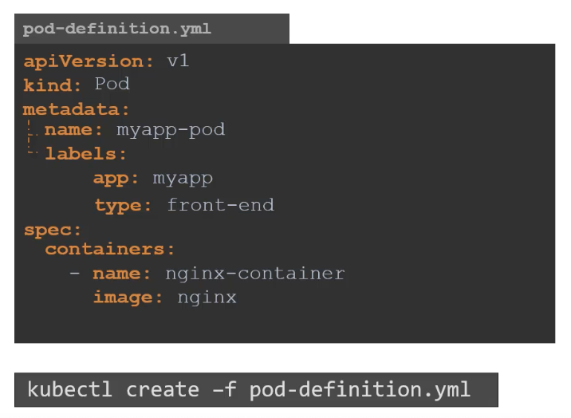

# 2. PODS with YAML

### How can we create a POD with YAML?

Every YAML file needed for kubernetes have these top level properties (also _required_):

- _apiVersion_:
- kind: What type of object are we trying to create? e.g. Pod/Service/ReplicaSet/Deployment.
- _metadata_: Data about the object e.g. name, labels (both helps you identidy the object later down the line) of the object. This is in the form of a Dictionary.
- _spec_: specification. This depends on the object you're going to create - different for different objects. e.g. containers (list) has name and image.

You can create the pod/or whatever object using the following command:

## Useful commands

`kubectl create -f pod-definition.yml`
Creates the pod from the YAML file

`kubectl get pods`
Shows you the pods created

`kubectl describe pod pod-name`
Shows you more details about the pod including the metadata etc. defined in your YAML file.
