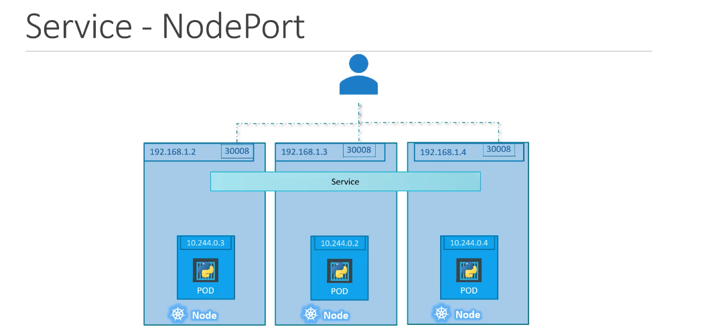

# 6. Services

Helps connect applications together
Enable connectivity between pods and external data source
Loose coupling of microservices

## Networking - External Communication

1. You have a pod in a node
2. And an external data source (outside of the node)

How do you connect these two together?

- You use a Service
- Service is like another object like pods/replica set
- A service is like a virtual server inside the node
- The service has it's own IP address

## Service Types

1. NodePort (external to pod)
2. ClusterIP (virtual ip inside cluster - back and front end services )
3. load balancer distribute load across

### Node Port

- Target port: where the service forwards the traffic to
- Port (the service port)
- NodePort (on the node)

## Definition for Service

- apiVersion: v1
- kind: Service
- metadata and name
- spec - so important that differenates from others. It is where you define the type of Service. In this case, we're specifying that we want the NodePort Service Type with a target port (on the pod) of 80, port 80 on the service and node Port of 30008.

```
spec:
    type: NodePort
    ports:
        - targetPort: 80
            port: 80
            nodePort: 30008
```

How do we specify which pod we're pointing to in the target port?

- You can use labels and selectors!

```
spec:
    type: NodePort
    ports:
        - targetPort: 80
            port: 80
            nodePort: 30008
    selector:
        app: myapp
        type: front-end
        developer: paulinenarvas
```

## Useful commands

`kubectl get services` or `kubectl get svc`

`curl http://IP-of-the-node:3008`

On minikube:
`minikube service name_of_service --url`
This spits out the URL of the service. In this case, it is an nginx server:

## Multiple Pods - connectivity

- label all the pods
- service definition looks for a specific label
- if pods are distributed across different nodes, a service spans across all the nodes in the cluster.



## ClusterIP

The same definition, but in the spec type change to ClusterIP. Used when connectivity between microservices i.e. between front-end pod and back-end pod. But the IP address is not static between the pods, so having a single service will help group the pods together.. this creates a single interface.

In this case, the targetPort is the backend port.
The port is where the service is exposed.

```
spec:
    type: ClusterIP
    ports:
        - targetPort: 80
            port: 80
    selector:
        app: myapp
        type: front-end
        developer: paulinenarvas
```

## Service-Load Balancer

When you set up a NodePort Service, it creates several URLs that can be accessed at their IP address. But what URL do you give to your customer? You'd want something like https://example.com/

On cloud, you can use Load Balancer e.g. Google Cloud Platform, AWS, Azure. This native load balancer can be defined using:

```
spec:
    type: LoadBalancer
    ports:
        - targetPort: 80
            port: 80
            nodePort: 30008
```

Unsupported environments like Virtual Box, this setting will be a NodePort by default. It won't do any load balancing!
