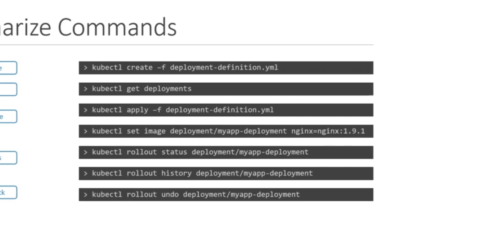

# Pod Design

## Labels, Selectors and Annotations

Labels and Selectors

- Standard to group things together
- e.g. Species of animals, based on kind, class, wild or demoistic, colour.
- Selectors filter specific groups
- e.g. Categories in blogging, online store

In K8, you need to be able to group the k8 objects (pods, replicasets, deployments, services) in the right type. So labels, selectors are useful for this.

e.g. orghanise by functionality, label, type.

For each object, you can add labels for whatever you want e.g. name, function.

Selectors can then find these labels.

In metadata, you can add labels:

```
app: App1
function: Front-end
```

`kubectl get pods --selector app=App1`

If you have a ReplicaSet object put want to specify a specific pod, then you can do so with Selectors by defining them in your replicaset-definition.yaml file.

labels at the top under metadata is about the replica set itself (it's own labels)

labels under template section is in the pod (selecting the pod)

```
spec:
    replicas: 3
    selector:
        matchLabels:
            app: App1
        template:
            metadata:
            labels:
                app: App1
                function: Front-end
```

## Annotations

- Record other details for informationary purposes e.g. version, build, contact details, email etc.
- Used for intergration purpose.

```
annotations:
    buildVersion: 1.34
```

# Deployment

# Updates and Rollback

When you create a deployment object, it triggers a rollout. It creates a new deployment revision (e.g. revision 1)

New deployment = new revision 2

It allows us to rollout if necessary

`kubectl rollout status deployment/my-appdeployment`

Deployment Straegy

1. Recreate Strategy - Destroy everything and deploy new ones. But this causes application down time.
2. Rolling Update Strategy - Take old version, bring up new version.

If you don't specify what type of deployment you are going for then it will automatically set up the rolling strategy.

How do you update your deployment?
e.g. labelling, the pods, the containers. We just modify the changes to file.

`kubectl apply`

A new rollout is triggered and a new version is released.

`kubectl set image deployment/my-app-deployment \ nginx=nginx:1.91` (inline)

`kubectl describe deployment` the recreate and rolling update is different. You can see this there!

# Commands



# Jobs and CronJobs

### Creating a job

- Job Definition in the yaml file

```
apiVersion: batch/v1
kind: Job
metadata:
    name: math-add-job
spec:
    template:
    spec:
        containers:
        - name: math-add
        image: ubuntu
        command: ['expr', '2', '+', '2']
    restartPolicy: never
```

When you create this, it creates a pod called math-add, using the image ubuntu and runs the job command 2+2. Usually it restarts but in this case, it doesn't becase of `restartPolicy` is set to `never`.

If you delete the job, you can delete the pod.

In the real world, it's a lot more complex e.g. for image processing.

You can also add multiple pods. They are created sequentionally. But can be done in parallel too. You have to set this up via the YAML file.

```
apiVersion: batch/v1
kind: Job
metadata:
    name: math-add-job
spec:
    completions: 3
    parallelism: 3
    template:
    spec:
        containers:
        - name: math-add
        image: ubuntu
        command: ['expr', '2', '+', '2']
    restartPolicy: never
```

### Cron Jobs

```
apiVersion: batch/v1
kind: CronJob
metadata:
    name: example-cron-job
spec:
    schedule: "*/1 * * * *"
    jobtemplate:
    spec:
    completions: 3
    parallelism: 3
    template:
        spec:
        containers:
        - name: math-add
        image: ubuntu
        command: ['expr', '2', '+', '2']
    restartPolicy: never
```

There are 3 specs here:

- for the cron job itself
- for the job i.e. how many pods
- for the pods itself
