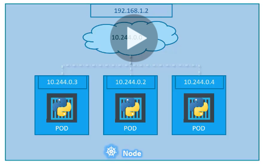
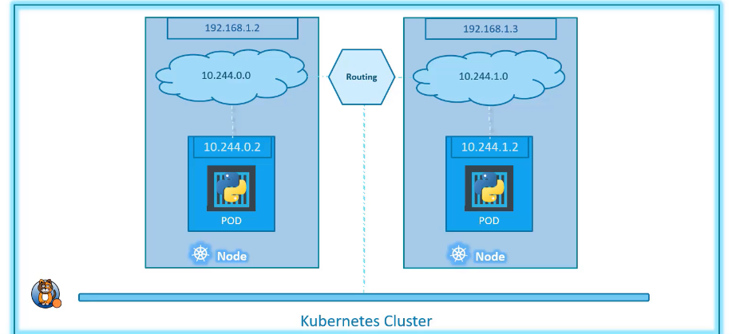

# Networking in Kubernetes

How can we access the node (i.e. the node that has the pods)?
IP address is assigned to a POD.
When Kubernetes set up, a network gets created in the node. This network creates the IP address for all the pods.

Remember the set up is:

- Cluster
  - Node(s) - i.e. virtual machine or physical machine
    - Pod
      - Container(s)

## Cluster Networking

- All containers/pods can communicate to one another without a NAT
- All nodes can communicate with all containers and vice versa without NAT
- There are networking solutions set up. So all pods can communicate with each other using the assigned IP address.
  
- Every pod gets its own IP address, they can be treated like virtual machines.
- Pods can communicate with all pods without NAT
